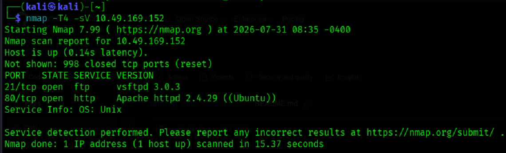
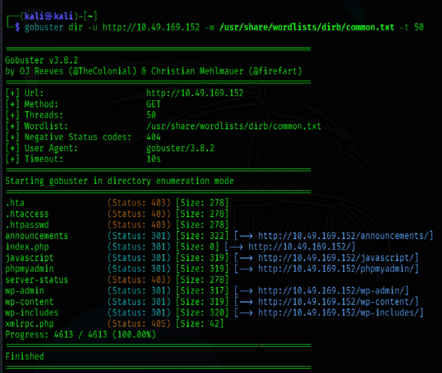
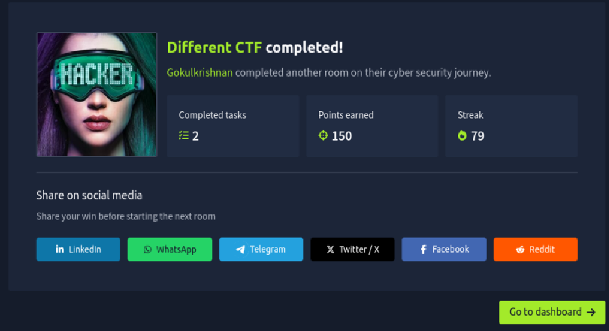

# Different CTF – TryHackMe Write-up

**Author:** Gokul Krishnan  
**Platform:** TryHackMe  
**Room:** Different CTF  
**Difficulty:** Hard  
**Status:** ✅ Completed

---

# Overview

The **Different CTF** room on TryHackMe is a hands-on Capture The Flag (CTF) challenge designed to strengthen practical penetration testing skills. Throughout this room, I applied a structured methodology to identify exposed services, enumerate the target, analyze the attack surface, obtain initial access, and perform Linux privilege escalation.

This repository serves as a **spoiler-free** documentation of my learning journey. It intentionally excludes flags, credentials, and detailed exploitation steps to respect TryHackMe's platform and encourage others to solve the challenge independently.

---

# Objectives

- Perform network reconnaissance
- Enumerate exposed services
- Identify potential attack vectors
- Analyze the target environment
- Gain initial access
- Perform Linux privilege escalation
- Capture the required flags
- Document the overall methodology

---

# Skills Practiced

- Network Enumeration
- Service Enumeration
- Web Enumeration
- Linux Enumeration
- Privilege Escalation
- Problem Solving
- Documentation

---

# Tools Used

- Nmap
- Gobuster
- Burp Suite
- Firefox
- Linux Terminal
- LinPEAS

---

# Methodology

## 1. Reconnaissance

The engagement began with comprehensive network reconnaissance to identify open ports, running services, and potential entry points.

Tasks performed:

- Full TCP port scan
- Service version detection
- Default NSE script scan
- Operating system fingerprinting

### Screenshot



---

## 2. Web Enumeration

After identifying the available web service, I performed directory and content enumeration to discover hidden resources and better understand the application's structure.

Activities included:

- Directory enumeration
- File discovery
- Source code inspection
- Manual web application analysis

### Screenshot



---

## 3. Initial Access & Privilege Escalation

Using the information gathered during reconnaissance and enumeration, I identified the intended attack path, obtained initial access, and successfully performed Linux privilege escalation through systematic local enumeration.

Throughout this phase, I focused on understanding the system configuration and identifying privilege escalation opportunities using standard enumeration techniques.

---

# Result

Successfully completed the **Different CTF** room and captured all required flags.

### Screenshot



---

# Key Takeaways

- Enumeration is the foundation of every successful penetration test.
- Small observations can lead to significant discoveries.
- Manual testing complements automated tools and often reveals valuable insights.
- A structured methodology improves efficiency and accuracy during security assessments.
- Consistent documentation reinforces learning and helps build a professional cybersecurity portfolio.

---

# Repository Structure

```text
different-ctf-writeup/
│
├── README.md
└── screenshots/
    ├── nmap.png
    ├── gobuster.png
    └── completion.png
```

---

# Disclaimer

This repository is published for educational purposes only. To respect the TryHackMe platform and its community, this write-up intentionally excludes challenge flags, credentials, passwords, and step-by-step exploitation details. The focus is on documenting methodology, tools, and key learning outcomes rather than providing a walkthrough.

---

## Connect With Me

If you'd like to connect or follow my cybersecurity learning journey, feel free to connect with me on LinkedIn and explore my GitHub profile for more labs, write-ups, and projects.

**Thank you for visiting this repository!**
