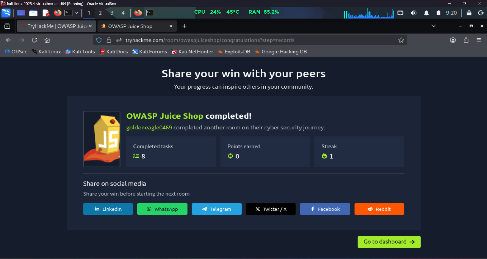
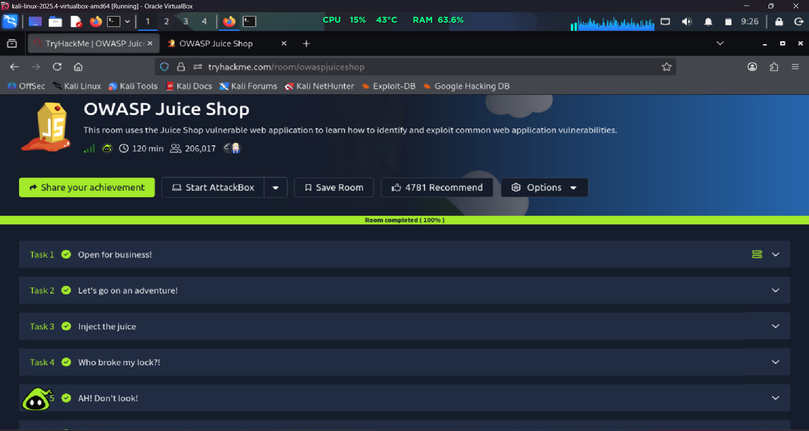

# 🧃 OWASP Juice Shop - TryHackMe Writeup

## 📌 Room Information

| Field      | Value                    |
| ---------- | ------------------------ |
| Platform   | TryHackMe                |
| Room Name  | OWASP Juice Shop         |
| Difficulty | Easy                     |
| Category   | Web Application Security |
| Status     | ✅ Completed              |

---

# 🎯 Objective

The OWASP Juice Shop room introduces common web application vulnerabilities using the intentionally vulnerable Juice Shop application.

The goal is to learn how attackers identify and exploit web vulnerabilities in a safe lab environment.

---

# 📚 Topics Covered

## SQL Injection

* Login bypass techniques
* Database query manipulation
* Input validation weaknesses

## Broken Authentication

* Weak authentication mechanisms
* Session management concepts

## Information Disclosure

* Exposure of sensitive information
* Security misconfigurations

## Web Application Enumeration

* Discovering application functionality
* Understanding attack surfaces

## OWASP Top 10 Awareness

* Injection
* Broken Authentication
* Sensitive Data Exposure
* Security Misconfiguration

---

# 🛠️ Tools Used

* Burp Suite Community Edition
* Firefox Browser
* Browser Developer Tools
* OWASP Juice Shop

---

# 🧠 What I Learned

* How vulnerable web applications behave
* Basics of SQL Injection
* Authentication weaknesses
* Importance of secure coding
* Practical use of Burp Suite
* Web application security fundamentals

---

# 🔑 Key Takeaways

* Never trust user input
* Validate and sanitize all input
* Use parameterized queries
* Implement secure authentication controls
* Follow OWASP security best practices

---

# 📸 Completion Proof

## Room Completion

---

## 100% Room Progress

---

# 🏆 Skills Demonstrated

* Web Application Testing
* Vulnerability Identification
* SQL Injection Fundamentals
* Authentication Testing
* Security Misconfiguration Analysis
* Burp Suite Basics

---

# 📖 Resources

* TryHackMe
* OWASP Top 10
* PortSwigger Web Security Academy
* OWASP Juice Shop Project

---

# ⚠️ Disclaimer

This writeup documents my learning experience on the TryHackMe training platform. All activities were performed in a legal lab environment designed for cybersecurity education and skill development.
