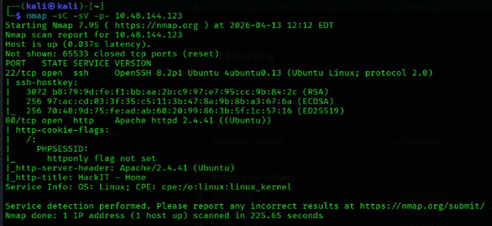
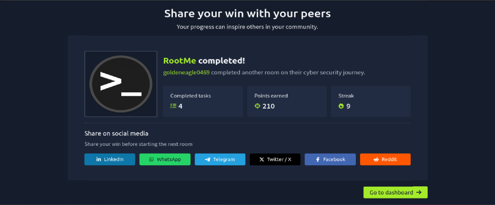

## 🔐 TryHackMe – RootMe Writeup


> **Platform:** [TryHackMe](https://tryhackme.com/room/rrootme)  

> **Difficulty:** Easy  

> **Category:** Web Exploitation, Privilege Escalation  

> **Status:** ✅ Completed  

> **Username:** goldeneagle0469


---


## 🧠 What I Learned

- How to perform network scanning using **Nmap**

- Importance of web enumeration in finding hidden directories

- File upload vulnerabilities and extension filter bypass

- PHP reverse shells

- Linux privilege escalation via **SUID binaries** (Python)

  


## 🔍 Step 1 — Reconnaissance


Used Nmap to scan open ports and identify services.  

Discovered HTTP service running on port 80, which became the main attack surface.


```bash

nmap -sC -sV -p- 10.48.144.123

```


**Results:**

- **Port 22:** SSH (OpenSSH 8.2p1 Ubuntu)

- **Port 80:** HTTP (Apache 2.4.41 Ubuntu) — Title: HackIT Home





---


## 🌐 Step 2 — Web Enumeration


Used **Gobuster** to find hidden directories on the web server:


```bash

gobuster dir -u http://10.48.144.123 -w /usr/share/wordlists/dirbuster/directory-list-2.3-medium.txt

```


**Key findings:**

- `/panel/`: A hidden file upload page.

- `/uploads/`: The directory where uploaded files are stored.


---


## 🌐 Step 3 — Web Exploitation


The `/panel/` page allowed file uploads, but blocked standard `.php` files. 


**Bypass Technique:** 

I renamed my reverse shell from `shell.php` to `shell.php5`. The server executed this extension, bypassing the upload filter.


1. **Payload:** [PentestMonkey PHP Reverse Shell](https://github.com/pentestmonkey/php-reverse-shell)

2. **Action:** Uploaded `shell.php5` via the `/panel/` directory.


---


## 🔗 Step 4 — Gaining Access


Set up a **Netcat** listener on my local machine:

```bash

nc -lvnp 4444

```


I then navigated to `http://10.48.144.123/uploads/shell.php5` to trigger the execution.


**Connection established!** I gained access as `www-data`. I located the first flag:

```bash

find / -name user.txt 2>/dev/null

cat /var/www/user.txt

```


---


## ⬆️ Step 5 — Privilege Escalation


I searched for binaries with the **SUID** bit set:

```bash

find / -perm /4000 2>/dev/null

```


I noticed `/usr/bin/python` had SUID permissions. Using a technique from **GTFOBins**, I escalated to root:


```bash

python -c 'import os; os.execl("/bin/sh", "sh", "-p")'

```


**Success:** I confirmed my identity with `whoami` (root) and grabbed the final flag in `/root/root.txt`.


---


## 🏁 Flags


| Flag | Location |

| :--- | :--- |

| **user.txt** | `/var/www/user.txt` |

| **root.txt** | `/root/root.txt` |


---


## 📚 Tools Used

| Tool | Purpose |

| :--- | :--- |

| **Nmap** | Network mapping and port scanning |

| **Gobuster** | Directory and file brute-forcing |

| **PHP Reverse Shell** | Initial foothold payload |

| **Netcat** | Catching the reverse shell |

| **GTFOBins** | Privilege escalation research |


---


### 🛡️ How to Prevent This


To mitigate the vulnerabilities exploited in this room, the following security measures should be implemented:


- Use proper input validation to prevent web vulnerabilities  

- Restrict SUID permissions on sensitive binaries  

- Keep systems updated with latest security patches  

- Limit unnecessary services and ports 


---


## 🏆 Completion





> **Disclaimer:** This writeup is for educational purposes only. Always practice ethical hacking in legal, authorized environments.

```
